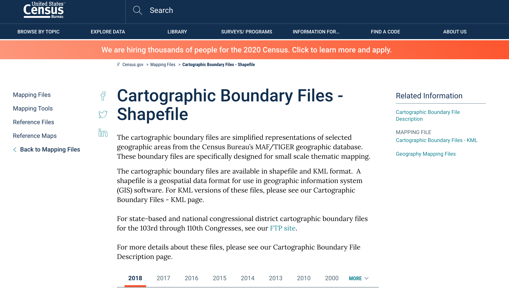
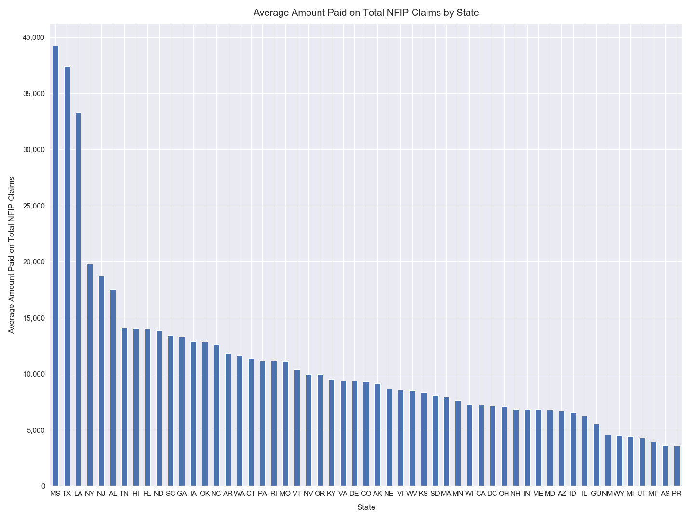
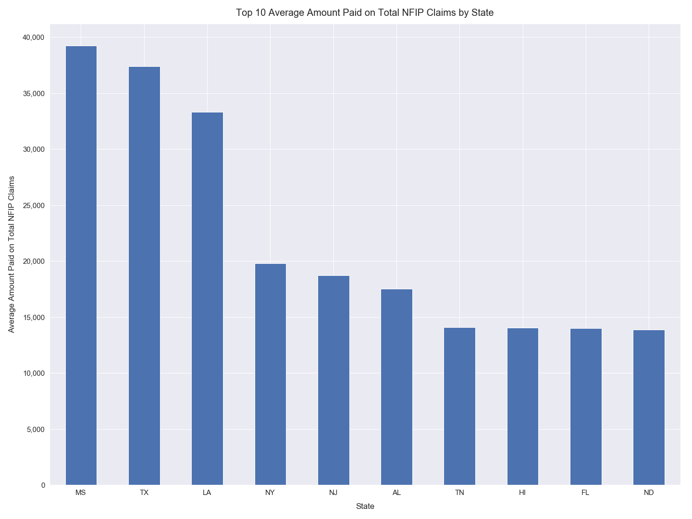
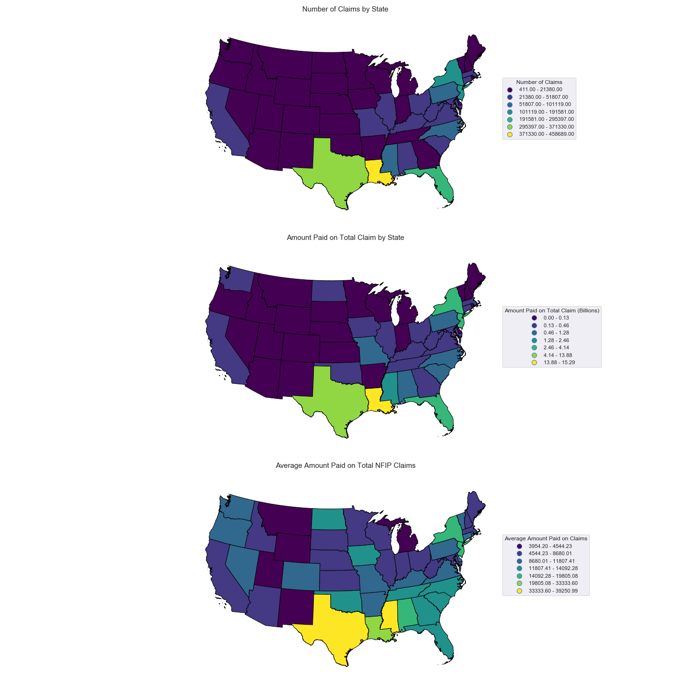

# Analyzing FEMA's National Flood Insurance Program (NFIP) Claims Data Using Python

*Author: Mark Bauer*

*Date Created: January 18, 2020*

# Introduction  

This analysis is designed to explore FEMA's NFIP claims dataset from 1978 to 2018.

You can find the raw code located in my notebook [nfip-claims-national.ipynb](https://github.com/mebauer/fema-nfip-claims/blob/master/nfip-claims-national/nfip-claims-national.ipynb).

Additionally, you can find and download the data dictionary provided by FEMA as as excel file (.xlsx) located in my data-dictionary folder [data-dictionary](https://github.com/mebauer/fema-nfip-claims/tree/master/nfip-claims-national/data-dictionary).

I am new to the open source community, so feedback is very welcome! Thank you for taking the time to read my notebook.

# Objective

Analyzing FEMA's National Flood Insurance Program (NFIP) Claims Dataset by Year of Loss and State.

# About the Dataset

FIMA NFIP Redacted Claims Data Set.

*Federal Insurance & Mitigation Administration National Flood Insurance Program (FIMA NFIP) Redacted Claims Dataset*

*This dataset represents more than 2,000,000 claims transactions. Due to the file size we recommend using Access, SQL, or another programming/data management tool to visualize and manipulate the data, as Excel will not be able to process files this large without data loss. Please note that there is a lag of 45 to 60 days for current data to be released. This data set is derived from the NFIP system of record, staged in the NFIP reporting platform and redacted to protect policy holder personally identifiable information.*

Source: [*FIMA NFIP Redacted Claims Data Set*](https://www.fema.gov/media-library/assets/documents/180374). 

**Note**: I  define the *Amount Paid Flood Claims* value as the sum of the amount paid on a claim for the *building and contents* only. I have excluded *increased cost of compliance* for this analysis.

# Data Wrangling

1. Download the NFIP Redacted Claims Dataset.

2. Group the claims dataframe by *Year of Loss* and *State*.

3. Map claims by State using the Census Bureau’s State Shapefile.

# How to Download the NFIP Redacted Claims Dataset

Data can be accessed from FEMA's Open Data Portal [here](https://www.fema.gov/media-library/assets/documents/180374).

Extract the NFIP Redacted Claims Dataset from this webpage. You need to download it directly as a zipfile, and then unzip the file once it is in your Dowloads folder. A screenshot of the claims dataset is below.

# How to Download State Boundary Files - Shapefile

Data can be accessed from the Census Bureau’s MAF/TIGER geographic database [here](https://www.census.gov/geographies/mapping-files/time-series/geo/carto-boundary-file.html).

Extract the Shapefile from this section. A screenshot is below.

# Results

## Tables

**Table 1: Top 10 Amounts Paid on Total NFIP Claims by Year of Loss**

| Flood Year    | Number of Claims | Amount Paid Flood Claims (Billions) | Average Paid Flood Claim
| ---- |--------:| ------:| -------:|
| 2005 | 27,7024 | $14.82 | $51,555 |
| 2017 | 145,466 |  $9.13 | $62,793 |
| 2012 | 175,789 |  $5.92 | $33,663 |
| 2016 |  85,463 |  $2.88 | $33,670 |
| 2008 |  96,972 |  $2.60 | $26,826 |
| 2004 |  76,033 |  $1.58 | $20,752 |
| 2011 |  96,461 |  $1.52 | $15,804 |
| 2018 |  42,429 |  $1.11 | $26,271 |
| 2001 |  54,492 |  $1.02 | $18,656 |
| 1995 |  79,582 |  $0.96 | $12,069 |

**Table 2: Top 10 Amounts Paid on Total NFIP Claims by State**

| State    | Number of Claims | Amount Paid Flood Claims (Billions) | Average Paid Flood Claim
| ---| -------:| ------:| -------:|
| LA | 458,785 | $15.29 | $33,327 |
| TX | 371,422 | $13.88 | $37,381 |
| FL | 295,451 |  $4.14 | $14,004 |
| NJ | 192,679 |  $3.59 | $18,653 |
| NY | 169,501 |  $3.31 | $19,550 |
| MS |  62,715 |  $2.46 | $39,240 |
| NC | 101,247 |  $1.28 | $12,622 |
| PA |  73,523 |  $0.82 | $11,120 |
| AL |  40,599 |  $0.71 | $17,511 |
| SC |  45,728 |  $0.61 | $13,444 |

## Figures

**Figure 1. Number of NFIP Claims by Year of Loss**

**Figure 2. Amount Paid on Total NFIP Claims by Year of Loss**

**Figure 3. Average Amount Paid on Total NFIP Claims by Year of Loss**

**Figure 4. Plots of Number, Total Amount Paid, and Average Amount Paid of NFIP Claims by Year of Loss**

**Figure 5. Top 10 Number of NFIP Claims by Year of Loss**

**Figure 6. Top 10 Amount Paid on Total NFIP Claims by Year of Loss**

**Figure 7. Top 10 Average Amount Paid on Total NFIP Claims by Year of Loss**

**Figure 8. Number of NFIP Claims by State**

**Figure 9. Top 10 Number of NFIP Claims by State**

**Figure 10. Amount Paid on Total NFIP Claims by State**

**Figure 11. Top 10 Amount Paid on Total NFIP Claims by State**

**Figure 12. Average Amount Paid on Total NFIP Claims by State**

**Figure 13. Top 10 Average Amount Paid on Total NFIP Claims by State**

**Figure 14. Number of NFIP Claims by State Map**

**Figure 15. Amount Paid on Total NFIP Claims by State Map**

**Figure 16. Average Amount Paid on Total NFIP Claims by State Map**

**Figure 17. Maps of Number, Total Amount Paid, and Average Amount Paid of NFIP Claims by State**

# Overall Conclusions

tbd...

